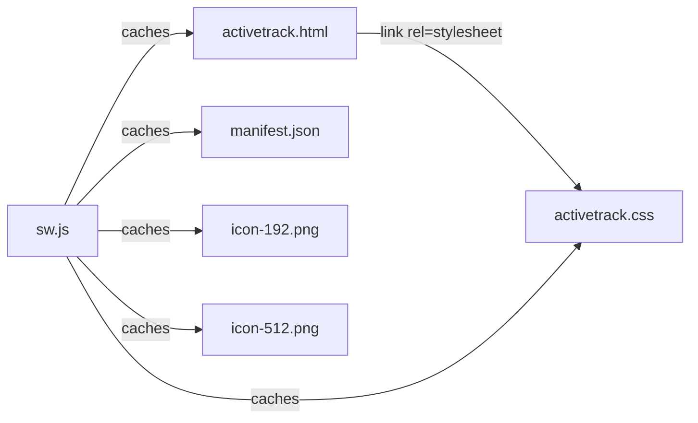
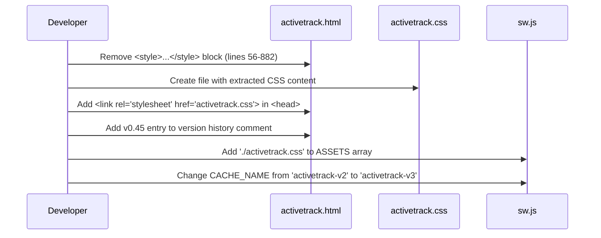

# Design Document: CSS Extraction

## Overview

This feature extracts the ~826 lines of inline CSS from the `<style>` block in `activetrack.html` (lines 56–882) into a separate `activetrack.css` file. The HTML file will reference the new stylesheet via a `<link>` element. The service worker (`sw.js`) will be updated to cache the new CSS file, and the version history comment block will be updated to document the change.

This is a pure refactoring operation — no CSS rules are added, removed, or modified. The goal is a byte-for-byte identical set of CSS rules in the new file, preserving order, specificity, and media queries.

### Key Design Decisions

1. **Same-directory placement**: `activetrack.css` lives alongside `activetrack.html` in the project root, matching the existing flat file structure and the relative `./` path convention used in `sw.js` and `manifest.json`.
2. **No CSS modifications**: The extracted CSS is copied verbatim — no minification, no reorganization, no autoprefixing. This eliminates any risk of visual regression.
3. **Cache-busting via cache name increment**: The service worker's `CACHE_NAME` is bumped from `activetrack-v2` to `activetrack-v3`, which triggers the install event and re-caches all assets including the new CSS file.

## Architecture

The change touches three existing files and creates one new file:



### File Change Summary

| File | Action |
|---|---|
| `activetrack.css` | **Created** — contains all CSS rules extracted from the style block |
| `CHANGELOG.md` | **Created** — contains full version history moved from the HTML comment block |
| `activetrack.html` | **Modified** — style block removed, `<link>` element added, version history replaced with reference to CHANGELOG.md |
| `sw.js` | **Modified** — `./activetrack.css` added to ASSETS, CACHE_NAME incremented |

### Extraction Flow



## Components and Interfaces

### 1. activetrack.css (New File)

The new stylesheet file containing all CSS extracted from the inline `<style>` block.

**Content**: The exact CSS content between the `<style>` and `</style>` tags (exclusive of the tags themselves). This includes:
- General styles (body, layout, typography)
- Dark mode styles (`body.dark-mode` selectors)
- Component styles (sidebar, dialog, settings panel, countdown, buttons, table, etc.)
- Animation keyframes (`@keyframes`)
- Responsive/mobile styles (`@media` queries)
- Theme toggle styles

**Constraints**:
- Rule order must be preserved exactly as in the original style block
- No whitespace normalization or formatting changes
- No additions or removals of any CSS rules

### 2. activetrack.html (Modified)

**Changes**:
- The `<style>...</style>` block (lines 56–882) is removed entirely
- A `<link rel="stylesheet" href="activetrack.css">` element is inserted in the `<head>` section, placed after the existing `<link>` elements (after the apple-touch-icon link, before `<title>`)
- The version history comment block is updated with a new `v0.45` entry

**Link element placement** (in `<head>`):
```html
<link rel="manifest" href="manifest.json">
<link rel="apple-touch-icon" href="icon-192.png">
<link rel="stylesheet" href="activetrack.css">
<title>ActiveTrack</title>
```

**Version history update**:
- The detailed version history comment block (v0.27–v0.44) is removed from the HTML
- Replaced with a brief comment referencing `CHANGELOG.md`
- The version number in the opening comment updates from `v0.44` to `v0.45`

**Simplified comment block**:
```html
<!--
ActiveTrack v0.45
Date: March 11, 2026
Creator: sefes

Automated time and activity logger. Asks what you're up to at regular intervals.
See CHANGELOG.md for version history.

Features:
...
-->
```

### 3. CHANGELOG.md (New File)

A standalone markdown file containing the full version history moved from the HTML comment block, plus the new v0.45 entry.

**Content structure**:
```markdown
# ActiveTrack Changelog

## v0.45 — March 11, 2026
- Extracted inline CSS to external `activetrack.css` file
- Moved version history from HTML comment block to CHANGELOG.md

## v0.44
- Replaced native alert/confirm dialogs with custom styled modals

## v0.43
- UI design overhaul — monochrome button hierarchy, consistent icon+tooltip system

... (all entries from v0.27 through v0.42)
```

**Constraints**:
- All existing version entries must be preserved
- Entries follow reverse chronological order (newest first)
- Each entry uses the same descriptions from the original comment block

### 4. sw.js (Modified)

**Changes**:
- `'./activetrack.css'` is added to the `ASSETS` array
- `CACHE_NAME` is changed from `'activetrack-v2'` to `'activetrack-v3'`

**Updated ASSETS array**:
```javascript
const CACHE_NAME = 'activetrack-v3';
const ASSETS = [
    './activetrack.html',
    './activetrack.css',
    './manifest.json',
    './icon-192.png',
    './icon-512.png'
];
```

## Data Models

This feature does not introduce any new data models, APIs, or state. It is a static file refactoring. The relevant "data" is:

- **CSS content**: A string of CSS rules, transferred verbatim from one location (inline style block) to another (external file).
- **ASSETS array**: A JavaScript array of relative path strings in `sw.js`. The new entry `'./activetrack.css'` follows the same `'./'` prefix convention as existing entries.
- **CACHE_NAME**: A version string following the pattern `'activetrack-vN'`. Incrementing from `v2` to `v3` ensures browsers install a fresh service worker and re-cache all assets.
- **Version history**: A plain-text comment block in the HTML file. Each entry follows the format `- vX.YY: Description of changes`.


## Correctness Properties

*A property is a characteristic or behavior that should hold true across all valid executions of a system — essentially, a formal statement about what the system should do. Properties serve as the bridge between human-readable specifications and machine-verifiable correctness guarantees.*

After analyzing all acceptance criteria, most are concrete example checks on specific files (link element exists, no style block remains, ASSETS array updated, etc.). The one true property that emerges from consolidating criteria 1.1, 1.4, and 2.2 is about content equivalence of the extracted CSS.

### Property 1: CSS extraction content equivalence

*For any* style block extracted from an HTML document, the content of the resulting CSS file must be byte-for-byte identical to the original style block content (excluding the `<style>` and `</style>` tags). This guarantees rule completeness, order preservation, and inclusion of all style categories (general, dark mode, responsive, component, animation).

**Validates: Requirements 1.1, 1.4, 2.2**

## Error Handling

Since this is a static file refactoring (no runtime logic changes), error handling focuses on preventing mistakes during the extraction process:

1. **Missing CSS file**: If `activetrack.css` is not deployed alongside `activetrack.html`, the page will have no styles. The service worker's network-first strategy with cache fallback mitigates this for returning users — the CSS will be served from cache if the network request fails.

2. **Stale service worker cache**: If the `CACHE_NAME` is not incremented, returning users may not pick up the new CSS file. The design mandates incrementing from `activetrack-v2` to `activetrack-v3` to force a cache refresh.

3. **Partial extraction**: If the style block is only partially extracted (e.g., some rules left in an inline `<style>` tag), styles could conflict or be duplicated. The acceptance criteria explicitly require that no inline `<style>` block remains after extraction (Requirement 1.3).

4. **Incorrect link path**: If the `<link>` element references a wrong path (e.g., `/activetrack.css` instead of `activetrack.css`), styles won't load. The design uses a relative path consistent with the existing conventions in `manifest.json` and `sw.js`.

## Testing Strategy

### Unit Tests (Example-Based)

Unit tests verify the concrete structural outcomes of the extraction. These are specific assertions on the final state of each modified file:

1. **Link element present** (Req 1.2): Parse `activetrack.html` and assert a `<link rel="stylesheet" href="activetrack.css">` element exists in the `<head>`.
2. **No inline style block** (Req 1.3): Parse `activetrack.html` and assert no `<style>` element exists.
3. **ASSETS array includes CSS** (Req 3.1): Parse `sw.js` and assert the ASSETS array contains `'./activetrack.css'`.
4. **Cache name incremented** (Req 3.2): Parse `sw.js` and assert `CACHE_NAME` is `'activetrack-v3'` (greater than the previous `'activetrack-v2'`).
5. **Version history entry exists** (Req 4.1): Parse `activetrack.html` and assert the version history comment block contains a `v0.45` entry referencing CSS extraction.
6. **Version entry format** (Req 4.2): Assert the new version entry matches the pattern `- v0.45: <description>` consistent with existing entries.

### Property-Based Tests

Property-based tests verify the universal correctness property using a property-based testing library (e.g., `fast-check` for JavaScript/TypeScript).

Each property test must run a minimum of 100 iterations and be tagged with a comment referencing the design property.

**Test 1: CSS extraction content equivalence**
- **Tag**: `Feature: css-extraction, Property 1: CSS extraction content equivalence`
- **Approach**: Generate random valid CSS content (varying rule counts, selector types, media queries, keyframes, comments). Wrap the generated CSS in `<style>...</style>` tags to simulate an inline style block. Apply the extraction function to produce the output. Assert the output is byte-for-byte identical to the original CSS content (before wrapping).
- **Validates**: Property 1 (Requirements 1.1, 1.4, 2.2)
- **Minimum iterations**: 100

### Manual / Integration Tests

The following criteria require browser-based verification and cannot be fully automated with unit or property tests:

- **Visual equivalence** (Req 2.1): Open the page before and after extraction, visually compare layout, colors, spacing, and typography.
- **Dark mode** (Req 2.3): Toggle dark mode and verify all dark mode styles apply correctly from the external stylesheet.
- **Offline caching** (Req 3.3): Disable network in DevTools, reload the page, and verify styles load from the service worker cache.
